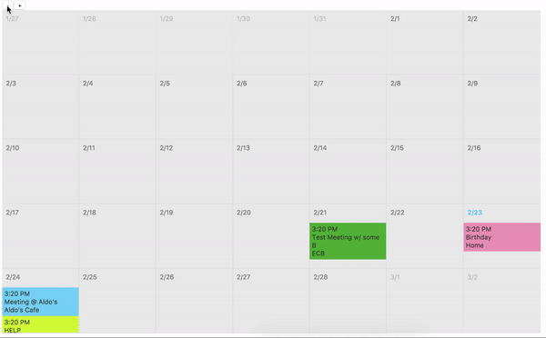

## &lt;Calenda**Rx** /&gt;

As easy as putting `<Calendarx />` in your React app.
First of many _prescribed_ React solutions.



## Usage

```javascript
import Calendarx from 'calendarx'

ReactDOM.render(
  <App>
    <Calendarx />
  </App>,
  document.getElementById('root')
)
```

The `Calendarx` view will adapt depending on the number of days that are specified
in `numDays`. If 4 is passed in, the first column will start with your
`referenceDate`, where if 7 is passed in the calendar will align itself to a
week view, and if say 35 is passed in, the calendar will pivot to show the entire
month.

## Options

| Option         | Default                                                       | Type                                               | Description                                               |
| :------------- | :------------------------------------------------------------ | :------------------------------------------------- | :-------------------------------------------------------- |
| events         | `[]`                                                          | `Array`                                            | Events passed into the calendar                           |
| referenceDate  | `Date.now()`                                                  | UTC Timestamp `String`, `Date`, `Moment`           | Where the calendar is centered around                     |
| numDays        | `35`                                                          | `Number`                                           | Number of days the calendar should display.               |
| width          | `'100%'`                                                      | `String` - CSS string, `Number` - number of pixels | Width of the calendar                                     |
| height         | `width` or `'600px'`                                          | `String` - CSS string, `Number` - number of pixels | Height of the calendar                                    |
| todayClass     | `'today'`                                                     | `String`                                           | Class to be applied to the `DateColumn` with today's date |
| currMonthClass | `'currMonth'`                                                 | `String`                                           | Class to be applied to dates of current month             |
| prevMonthClass | `'prevMonth'`                                                 | `String`                                           | Class to be applied to dates of previous month            |
| nextMonthClass | `'nextMonth'`                                                 | `String`                                           | Class to be applied to dates of next month                |
| prevMonthStyle | `{ opacity: 0.4 }`                                            | `Object` - follow React style syntax               | Style to be applied to dates of previous month            |
| nextMonthStyle | `{ opacity: 0.4 }`                                            | `Object` - follow React style syntax               | Style to be applied to dates of next month                |
| themeColor     | `'#4dc2fa'`                                                   | `String` - CSS                                     | Accents things like today's date and events               |
| EventComponent | see [Overriding Event Component](#overriding-event-component) | `React Class`                                      | Component to display events                               |

## Calendar Events

Passing an `events` array to `<Calendarx />` will create an `EventComponent`
instance for each event, spreading each event as props to the component.
A valid [`Moment`](http://momentjs.com/docs) time is the only required prop to create an event.

### Example

```javascript
const events = [
  {
    id: 1,
    title: 'Birthday',
    time: moment()
      .add(0, 'd')
      .format(),
    location: 'Home',
    color: '#f284a8'
  }
]
const App = () => <Calendarx events={events} />
```

### Overriding Event Component

The default `EventComponent` class is rendered like this:

```javascript
const DefaultEvent = () => (
  <div
    { /* if the event is today */ }
    className='calendarEvent today'
    style={details.style || DEFAULT_STYLE}
  >
    <p className="event_details" style={{ margin: 0 }}>
      {moment(details.time).format('LT')}<br />
      { details.title }<br />
      { details.location }<br />
    </p>
  </div>
)
```

with custom `className`s embedded.

You may pass in a new `React` component to override how your events are displayed in the calendar:

```javascript
const NewEventComponent = details => <p>{details.time}</p>

render(
  <Calendarx events={fakeEvents} EventComponent={NewEventComponent} />,
  document.getElementById('calendar')
)
```

## Contributing

Please do! This is definitely just a start, and we could use some help. If you have ideas, fixes, or inspirations, please [submit a PR](https://github.com/mfix22/calendarx/pulls).

## Inspiration (I thought 'Props' would be confusing)

This project was inspired by Kyle Stetz's [CLNDR](http://kylestetz.github.io/CLNDR/).
